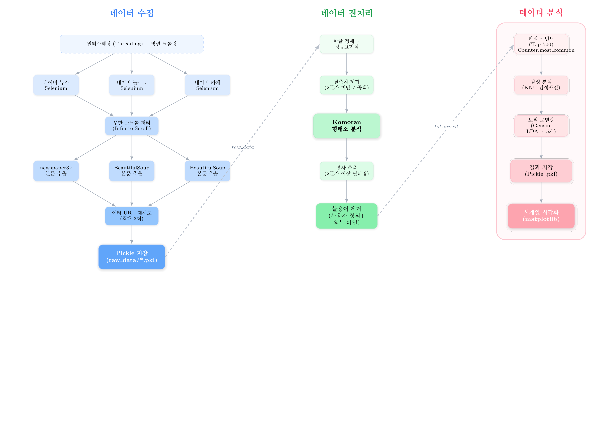

# 국민연금 텍스트 마이닝 및 감성 분석 프로젝트

## 프로젝트 개요

본 프로젝트는 국민연금에 대한 대중의 인식을 파악하기 위해 네이버 플랫폼(뉴스, 블로그, 카페)의 데이터를 수집하고 텍스트 마이닝 기법을 적용한 연구입니다. 2022년 5월부터 2024년 4월까지 약 2년간의 데이터를 대상으로 감성 분석, 토픽 모델링, 시계열 분석을 수행하여 시기별 여론 동향과 주요 이슈를 파악합니다.

### 주요 분석 결과

| 데이터 소스 | 수집 건수 | 전처리 후 건수 | 분석 기간 |
|:-----------:|:---------:|:--------------:|:---------:|
| 네이버 뉴스 | 58,089 | 52,029 | 2022.05 ~ 2024.04 |
| 네이버 블로그 | 24,480 | 24,480 | 2022.05 ~ 2024.04 |
| 네이버 카페 | 22,200 | 22,200 | 2022.05 ~ 2023.04 |
| **합계** | **104,769** | **98,709** | - |

---

## 프로젝트 구조

```
nationalpension_textmining/
│
├── data_collect/                          # 데이터 수집 모듈
│   ├── pension_news_crawling.ipynb        # 네이버 뉴스 크롤링
│   ├── pension_blog_crawling.ipynb        # 네이버 블로그 크롤링
│   └── pension_cafe_crawling.ipynb        # 네이버 카페 크롤링
│
├── analysis_code/                         # 데이터 분석 모듈
│   ├── news_preprocessing_and_analysis.ipynb      # 뉴스 전처리, 감성분석, 토픽모델링
│   ├── cafe_blog_preprocessing_and_analysis.ipynb # 블로그/카페 통합 분석
│   ├── news_time_series_visualization.ipynb       # 뉴스 감성 점수 시계열 시각화
│   └── blog_time_series_visualization.ipynb       # 블로그 감성 점수 시계열 시각화
│
├── data/                                  # 데이터 디렉토리 (gitignore)
│   ├── raw_data/                          # 수집된 원본 데이터
│   │   ├── pension_news.pkl
│   │   ├── pension_blog.pkl
│   │   └── pension_cafe.pkl
│   └── analysis_data/                     # 분석 결과 데이터
│       ├── *_top500.csv                   # 키워드 빈도 분석 결과
│       └── ...
│
├── .gitignore
└── README.md
```

## 데이터 파이프라인




---

## 기술 스택

### 데이터 수집
| 라이브러리 | 용도 |
|-----------|------|
| Selenium | 동적 웹페이지 크롤링, 무한 스크롤 처리 |
| BeautifulSoup4 | HTML 파싱 |
| newspaper3k | 뉴스 본문 추출 |
| Threading | 멀티스레딩 기반 병렬 크롤링 |

### 데이터 전처리 및 분석
| 라이브러리 | 용도 |
|-----------|------|
| Konlpy (Komoran) | 한국어 형태소 분석, 명사 추출 |
| Pandas | 데이터프레임 조작 |
| NumPy | 수치 연산 |
| re (정규표현식) | 텍스트 정제 |

### 분석 및 시각화
| 라이브러리 | 용도 |
|-----------|------|
| scikit-learn | LDA 토픽 모델링 |
| matplotlib | 시계열 그래프 시각화 |
| tqdm | 진행률 표시 |

---

## 데이터 파이프라인

```
┌─────────────────────────────────────────────────────────────────────────────┐
│                              데이터 수집 단계                                 │
├─────────────────────────────────────────────────────────────────────────────┤
│                                                                             │
│  ┌──────────────┐    ┌──────────────┐    ┌──────────────┐                  │
│  │  네이버 뉴스  │    │  네이버 블로그 │    │  네이버 카페  │                  │
│  │   크롤링     │    │    크롤링     │    │    크롤링     │                  │
│  └──────┬───────┘    └──────┬───────┘    └──────┬───────┘                  │
│         │                   │                   │                          │
│         ▼                   ▼                   ▼                          │
│  ┌──────────────────────────────────────────────────────┐                  │
│  │              newspaper3k 본문 추출                    │                  │
│  │         (제목, 본문, 발행일, 좋아요, 댓글 등)           │                  │
│  └──────────────────────────┬───────────────────────────┘                  │
│                             │                                               │
│                             ▼                                               │
│  ┌──────────────────────────────────────────────────────┐                  │
│  │         data/raw_data/*.pkl (Pickle 저장)            │                  │
│  └──────────────────────────────────────────────────────┘                  │
│                                                                             │
└─────────────────────────────────────────────────────────────────────────────┘

┌─────────────────────────────────────────────────────────────────────────────┐
│                            데이터 전처리 단계                                 │
├─────────────────────────────────────────────────────────────────────────────┤
│                                                                             │
│  ┌──────────────────────────────────────────────────────┐                  │
│  │  1. 한글 정제 (정규표현식: [^0-9a-zA-Zㄱ-ㅎㅏ-ㅣ가-힣 ]) │                  │
│  │  2. 결측치 제거 (본문 2글자 미만/공백 문서 삭제)        │                  │
│  │  3. 중복 데이터 제거                                   │                  │
│  └──────────────────────────┬───────────────────────────┘                  │
│                             │                                               │
│                             ▼                                               │
│  ┌──────────────────────────────────────────────────────┐                  │
│  │  Komoran 형태소 분석                                   │                  │
│  │  - pos(): 형태소 + 품사 태깅                           │                  │
│  │  - nouns(): 명사 추출 (2글자 이상만 필터링)            │                  │
│  └──────────────────────────┬───────────────────────────┘                  │
│                             │                                               │
│                             ▼                                               │
│  ┌──────────────────────────────────────────────────────┐                  │
│  │  불용어 제거 (사용자 정의 불용어 사전 적용)             │                  │
│  └──────────────────────────────────────────────────────┘                  │
│                                                                             │
└─────────────────────────────────────────────────────────────────────────────┘

┌─────────────────────────────────────────────────────────────────────────────┐
│                             데이터 분석 단계                                  │
├─────────────────────────────────────────────────────────────────────────────┤
│                                                                             │
│  ┌────────────────────┐    ┌────────────────────┐    ┌──────────────────┐  │
│  │   키워드 빈도 분석   │    │    감성 분석       │    │   토픽 모델링    │  │
│  │   (Top 500 추출)   │    │  (사전 기반 방식)   │    │      (LDA)       │  │
│  └─────────┬──────────┘    └─────────┬──────────┘    └────────┬─────────┘  │
│            │                         │                        │            │
│            ▼                         ▼                        ▼            │
│  ┌──────────────────────────────────────────────────────────────────────┐  │
│  │                     data/analysis_data/                              │  │
│  │  - *_top500.csv: 키워드 빈도                                          │  │
│  │  - 감성 점수 데이터                                                   │  │
│  │  - 토픽 모델링 결과                                                   │  │
│  └──────────────────────────────────────────────────────────────────────┘  │
│                                                                             │
│                             │                                               │
│                             ▼                                               │
│  ┌──────────────────────────────────────────────────────────────────────┐  │
│  │                        시계열 시각화                                  │  │
│  │            (월별/분기별 감성 점수 변화 추이, matplotlib)               │  │
│  └──────────────────────────────────────────────────────────────────────┘  │
│                                                                             │
└─────────────────────────────────────────────────────────────────────────────┘
```

---

## 설치 및 실행 방법

### 1. 환경 설정

```bash
# 필수 라이브러리 설치
pip install pandas numpy selenium beautifulsoup4 requests konlpy matplotlib scikit-learn newspaper3k tqdm

# Chrome WebDriver 설치 (크롤링에 필요)
# Ubuntu/Debian
sudo apt-get install chromium-browser chromium-chromedriver

# macOS
brew install chromedriver

# 또는 webdriver-manager 사용
pip install webdriver-manager
```

### 2. 데이터 다운로드

본 프로젝트에서 사용된 원본 데이터는 Hugging Face에서 다운로드할 수 있습니다.

```bash
# 데이터셋 다운로드
# https://huggingface.co/datasets/bong9513/nationalpension_textmining_crawled_rawdata
```

다운로드 후 `data/raw_data/` 디렉토리에 배치하세요.

### 3. 실행 순서

#### Step 1: 데이터 수집 (선택사항)
이미 수집된 데이터가 있다면 이 단계는 건너뛸 수 있습니다.

```bash
# Jupyter Notebook 실행
jupyter notebook

# 순서대로 실행
# 1. data_collect/pension_news_crawling.ipynb
# 2. data_collect/pension_blog_crawling.ipynb
# 3. data_collect/pension_cafe_crawling.ipynb
```

#### Step 2: 데이터 전처리 및 분석

```bash
# 순서대로 실행
# 1. analysis_code/news_preprocessing_and_analysis.ipynb
# 2. analysis_code/cafe_blog_preprocessing_and_analysis.ipynb
```

#### Step 3: 시계열 시각화

```bash
# 1. analysis_code/news_time_series_visualization.ipynb
# 2. analysis_code/blog_time_series_visualization.ipynb
```

---

## 크롤링 기술 상세

### 멀티스레딩 기반 병렬 크롤링

본 프로젝트는 크롤링 속도 향상을 위해 멀티스레딩을 적용했습니다.

| 항목 | 단일 스레드 | 멀티스레딩 (24개) | 개선 효과 |
|------|------------|------------------|-----------|
| 뉴스 크롤링 | 약 15시간 예상 | 2시간 16분 | **약 85% 단축** |
| 블로그 크롤링 | 약 15시간 예상 | 1시간 33분 | **약 90% 단축** |

### 크롤링 구현 특징

1. **Headless Chrome**: GUI 없이 백그라운드 실행
2. **무한 스크롤 처리**: JavaScript 실행으로 전체 데이터 로드
3. **에러 복구**: 실패한 URL에 대한 재시도 로직 (최대 3회)
4. **데이터 무결성**: 로컬 리스트 → 글로벌 리스트 순차 병합

### 수집 데이터 필드

#### 뉴스 데이터
| 필드 | 설명 |
|------|------|
| title | 뉴스 제목 |
| doc | 뉴스 본문 |
| published_date | 발행 일시 |
| ch | 채널 (naver) |

#### 블로그/카페 데이터
| 필드 | 설명 |
|------|------|
| title | 글 제목 |
| doc | 글 본문 |
| like_cnt | 좋아요 수 |
| comment_cnt | 댓글 수 |
| comment_list | 댓글 내용 |
| img_cnt | 이미지 수 |
| div_cnt | 동영상 수 |
| publish_date | 작성 월 |
| ch | 채널 (naver) |
| ch2 | 세부 채널 (blog/cafe) |

---

## 분석 방법론

### 1. 텍스트 전처리

```python
# 한글 정제 (영문, 한글, 숫자, 공백만 유지)
re.sub("[^0-9a-zA-Zㄱ-ㅎㅏ-ㅣ가-힣 ]", "", text)

# 형태소 분석 (Komoran)
from konlpy.tag import Komoran
komoran = Komoran()
nouns = [term for term in komoran.nouns(text) if len(term) > 1]
```

### 2. 감성 분석

사전 기반 감성 분석 방식을 적용합니다.

- **감성 사전**: `SentiWord_info.json`, `Korean-NRC-EmoLex.txt`
- **분류**: 긍정 / 부정 / 중립
- **점수화**: 감성 단어 가중치 합산

### 3. 토픽 모델링

LDA (Latent Dirichlet Allocation)를 활용한 주제 추출

- **입력**: 명사 토큰 리스트
- **출력**: 토픽별 상위 키워드 구성

---

## 데이터셋 정보

### 원본 데이터

- **저장소**: [Hugging Face - bong9513/nationalpension_textmining_crawled_rawdata](https://huggingface.co/datasets/bong9513/nationalpension_textmining_crawled_rawdata)
- **형식**: Pickle (.pkl)
- **크기**: 약 105,000건의 텍스트 데이터

### 감성 사전 및 불용어

`data/` 디렉토리 내에 포함된 리소스:
- 감성 사전 파일들
- 사용자 정의 불용어 리스트

---

## 주요 발견 및 인사이트

### 키워드 빈도 분석 결과

분석 결과 상위 키워드는 다음과 같은 주제로 그룹화됩니다:

1. **연금 제도 관련**: 국민연금, 연금개혁, 보험료, 수급연령
2. **사회보험 연계**: 건강보험, 건보료, 4대보험
3. **재정 이슈**: 국민연금기금, 수익률, 고갈
4. **정책 논의**: 연금특위, 개혁안, 국회

### 감성 분석 인사이트

- 전반적으로 뉴스는 중립적 성향이 강함
- 블로그/카페는 개인적 경험 공유로 인해 감성 변동폭이 큼
- 정책 발표 시점에 감성 점수 급변 패턴 관찰

---

## 한계점 및 향후 연구 방향

### 한계점
1. 네이버 플랫폼에 한정된 데이터 수집
2. 감성 사전 기반 분석의 정확도 한계
3. 시기별 이슈와 감성 변화의 인과관계 파악 부족

### 향후 연구 방향
1. 다양한 플랫폼(커뮤니티, SNS) 데이터 확장
2. 머신러닝 기반 감성 분석 모델 도입
3. 외부 이슈(정책 발표, 뉴스 이벤트)와 감성 변화의 상관관계 분석

---

## 라이선스

본 프로젝트는 연구 목적으로 제작되었습니다. 데이터 사용 시 출처를 명시해 주세요.

---

## 작성자

- **데이터 수집 및 분석**: bong9513
- **데이터셋**: [Hugging Face](https://huggingface.co/datasets/bong9513/nationalpension_textmining_crawled_rawdata)